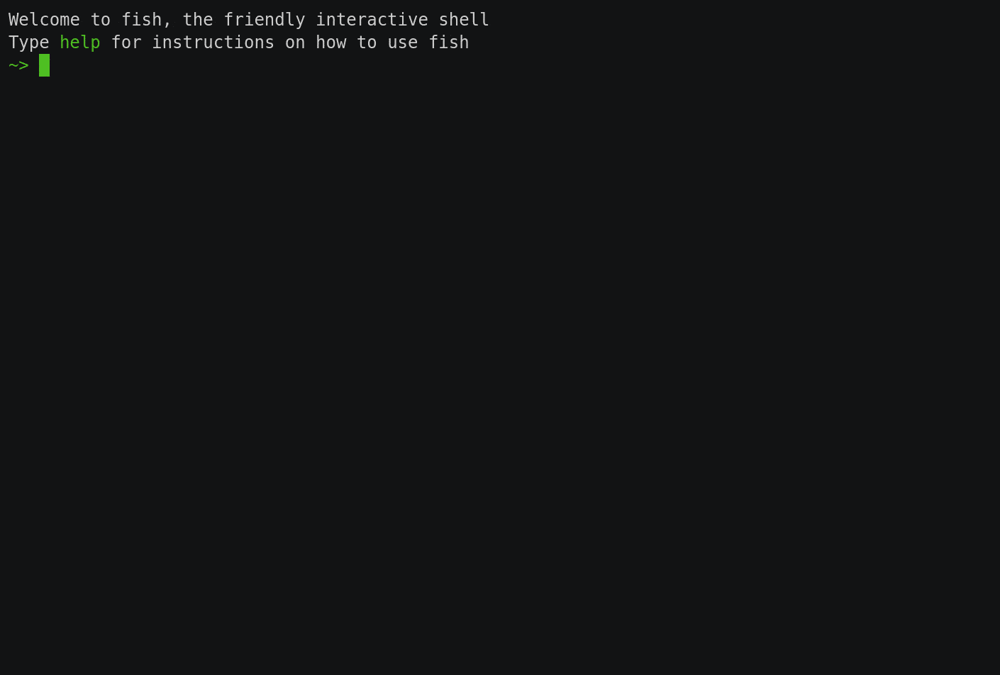
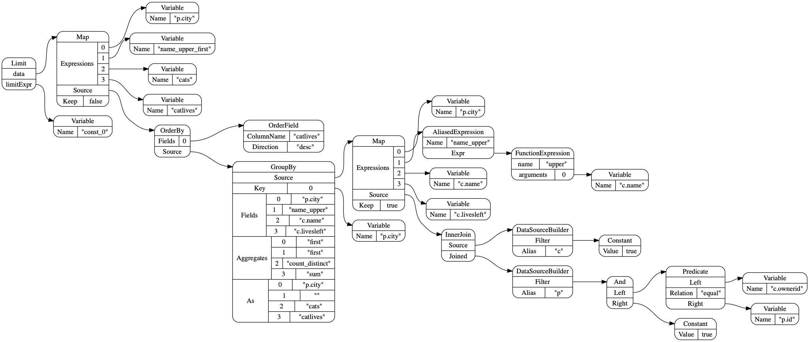

OctoSQL
=======
OctoSQL is a query tool that allows you to join, analyse and transform data from multiple databases, streaming sources and file formats using SQL.

[](https://circleci.com/gh/cube2222/octosql)
[](https://godoc.org/github.com/cube2222/octosql)
[](https://gitter.im/octosql/general?utm_source=badge&utm_medium=badge&utm_campaign=pr-badge)

## Problems OctoSQL Solves
- You need to join / analyze data from multiple datasources. 
    - Think of enriching an Excel file by joining it with a PostgreSQL database.
- You need stream aggregates over time, with live output updates.
    - Think of a live-updated leaderboard with cat images based on a "like" event stream.
- You need aggregate streams per time window, with live output updates.
    - Think of a unique user count per hour, per country live summary.



## Table of Contents
- [What is OctoSQL?](#what-is-octosql)
- [Installation](#installation)
- [Quickstart](#quickstart)
- [Temporal SQL Features](#temporal-sql-features)
  - [Watermarks](#watermarks)
  - [Triggers](#triggers)
  - [Retractions](#retractions)
  - [Example](#example)
- [Durability](#durability)
- [Configuration](#configuration)
  - [JSON](#json)
  - [CSV](#csv)
  - [Excel](#excel)
  - [Parquet](#parquet)
  - [PostgreSQL](#postgresql)
  - [MySQL](#mysql)
  - [Redis](#redis)
  - [Kafka](#kafka)
- [Documentation](#documentation)
- [Architecture](#architecture)
- [Datasource Pushdown Operations](#datasource-pushdown-operations)
- [Roadmap](#roadmap)

## What is OctoSQL?
OctoSQL is a SQL query engine which allows you to write standard SQL queries on data stored in multiple SQL databases, NoSQL databases, streaming sources and files in various formats trying to push down as much of the work as possible to the source databases, not transferring unnecessary data. 

OctoSQL does that by creating an internal representation of your query and later translating parts of it into the query languages or APIs of the source databases. Whenever a datasource doesn't support a given operation, OctoSQL will execute it in memory, so you don't have to worry about the specifics of the underlying datasources. 

OctoSQL also includes temporal SQL extensions, to operate ergonomically on streams and respect their event-time (not the current system-time when the records are being processed).

With OctoSQL you don't need O(n) client tools or a large data analysis system deployment. Everything's contained in a single binary.

### Why the name?
OctoSQL stems from Octopus SQL.

Octopus, because octopi have many arms, so they can grasp and manipulate multiple objects, like OctoSQL is able to handle multiple datasources simultaneously.

## Installation
Either download the binary for your operating system (Linux, OS X and Windows are supported) from the [Releases page](https://github.com/cube2222/octosql/releases), or install using the go command line tool:
```bash
GO111MODULE=on go get -u github.com/cube2222/octosql/cmd/octosql
```

## Quickstart
Let's say we have a csv file with cats, and a redis database with people (potential cat owners). Now we want to get a list of cities with the number of distinct cat names in them and the cumulative number of cat lives (as each cat has up to 9 lives left).

First, create a configuration file ([Configuration Syntax](#configuration))
For example:
```yaml
dataSources:
  - name: cats
    type: csv
    config:
      path: "~/Documents/cats.csv"
  - name: people
    type: redis
    config:
      address: "localhost:6379"
      password: ""
      databaseIndex: 0
      databaseKeyName: "id"
```

Then, set the **OCTOSQL_CONFIG** environment variable to point to the configuration file.
```bash
export OCTOSQL_CONFIG=~/octosql.yaml
```
You can also use the --config command line argument.

Finally, query to your hearts desire:
```bash
octosql "SELECT p.city, FIRST(c.name), COUNT(DISTINCT c.name) cats, SUM(c.livesleft) catlives
FROM cats c JOIN people p ON c.ownerid = p.id
GROUP BY p.city
ORDER BY catlives DESC
LIMIT 9"
```
Example output:
```
+---------+--------------+------+----------+
| p.city  | c.name_first | cats | catlives |
+---------+--------------+------+----------+
| Warren  | Zoey         |   68 |      570 |
| Gadsden | Snickers     |   52 |      388 |
| Staples | Harley       |   54 |      383 |
| Buxton  | Lucky        |   45 |      373 |
| Bethany | Princess     |   46 |      366 |
| Noxen   | Sheba        |   49 |      361 |
| Yorklyn | Scooter      |   45 |      359 |
| Tuttle  | Toby         |   57 |      356 |
| Ada     | Jasmine      |   49 |      351 |
+---------+--------------+------+----------+
```
You can choose between live-table batch-table live-csv batch-csv stream-json output formats. (The live-* types will update the terminal view repeatedly every second, the batch-* ones will write the output once before exiting, the stream-* ones will print records whenever they are available)

## Temporal SQL Features
OctoSQL features temporal SQL extensions inspired by the paper [One SQL to Rule Them All](https://arxiv.org/abs/1905.12133).

### Introduction
Often when you're working with streams of events, you'd like to use the time dimension somehow:
- Calculate average values for a day sliced by hours.
- Get unique user counts per day.
- and others

All those examples have one thing in common: The time value of an event is crucial for correctness.

A naive system could just use the current clock time whenever it receives an event. The correctness of this approach however, degrades quickly in the face of network problems, delivery delays, clock skew.

This can be solved by using a value from the event as its time value. A new problem arises though: how do I know that I've received all events up to time X and can publish results for a given hour. You never know if there isn't somewhere a delayed event which should be factored in.

This is where watermarks come into play.

### Watermarks

Watermarks are a heuristic which try to approximate the "current time" when processing events. Said differently: When I receive a watermark for 12:00 I can be sure enough I've received all events of interest up to 12:00.

To achieve this, they are generated at streaming sources and propagate downstream through the whole processing pipeline.

The generation of watermarks usually relies on heuristics which provide satisfactory results for our given use case. OctoSQL currently contains the following watermark generators:
- Maximum difference watermark generator (with an `offset` argument)
  
  With an offset of 10 seconds, this generator says: When I've received an event for 12:00:00, then I'm sure I won't receive any event older than 11:59:50.
- Percentile watermark generator (with a `percentile` argument)
  
  With a percentile of 99.5, it will look at a specified number of recent events, and generate a watermark so that 99.5% of those events are after the watermark (not yet triggered), and the remaining 0.5% are before it. This way we set the watermark so that only a fraction of the recently seen events is potentially ignored as being late.

Watermark generators are specified using table valued functions and are documented in [the wiki](https://github.com/cube2222/octosql/wiki/Table-Valued-Functions-Documentation).

### Triggers
Another matter is triggering of keys in aggregations.
Sometimes you'd like to only see the value for a given key (hour) when you know it's done, but othertimes you'd like to see partial results (how's the unique user count going this hour).

That's where you can use triggers. Triggers allow you to specify when a given aggregate (or join window for that matter) is emitted or updated. OctoSQL contains multiple triggers:
- Watermark Trigger

  This is the most straightforward trigger. It emits a value whenever the watermark for a given key (or the end of the stream) is reached. So basically the "show me when it's done".
- Counting Trigger (with a `count` argument)

  This trigger will emit a value for a key every time it receives `count` records with this key. The count is reset whenever the key is triggered.
- Delay Trigger (with a `delay` argument)

  This trigger will emit a value for a key whenever the key has been inactive for the `delay` period.

You can use multiple triggers simultaneously. (Show me the current sum every 10 received events, but also the final value after having received the watermark.)

### Retractions
A key can be triggered multiple times with partial results. How do we know a given record is a retriggering of some key, and not a new unrelated record?

OctoSQL solves this problem using a dataflow-like architecture. This means whenever a new value is sent for a key, a retraction is send for the old value. In practice this means every update is accompanied by the old record with an `undo` flag set.

This can be visible when using a stream-* output format with partial results.

### Example
Now we can see how it all fits together. In this example we have an events file, which contains records about points being scored in a game by multiple teams.
```sql
WITH
      with_watermark AS (SELECT *
                         FROM max_diff_watermark(source=>TABLE(events),
                                                 offset=>INTERVAL 5 SECONDS,
                                                 time_field=>DESCRIPTOR(time)) e),
      with_tumble AS (SELECT *
                      FROM tumble(source=>TABLE(with_watermark),
                                  time_field=>DESCRIPTOR(e.time),
                                  window_length=> INTERVAL 1 MINUTE,
                                  offset => INTERVAL 0 SECONDS) e),
      counts_per_team AS (SELECT e.window_end, e.team, COUNT(*) as goals
                          FROM with_tumble e
                          GROUP BY e.window_end, e.team TRIGGER COUNTING 100, ON WATERMARK)
SELECT *
FROM counts_per_team cpt
ORDER BY cpt.window_end DESC, cpt.goals ASC, cpt.team DESC
```

We use common table expressions to break the query up into multiple stages.

First we create the *with_watermark* intermediate table/stream. Here we use the table valued function `max_diff_watermark` to add watermarks to the events table - with an offset of 5 seconds based on the *time* record field.

Then we use this intermediate table to create the *with_tumble* table, where we use the *tumble* table valued function to add a window_start and window_end field to each record, based on the record's *time* field. This assigns the records to 1 minute long windows.

Next we create the *counts_per_team* table, which groups the records by their window end and team.

Finally, we order those results by window end, goal count and team.

## Durability
OctoSQL in its current design is based on on-disk transactional storage.

All state is saved this way. All interactions with datasources are designed so that no records get duplicated in the face of errors or application restarts.

You can also kill the OctoSQL process and start it again with the same query and storage-directory (command line argument), it will start where it left off.

By default, OctoSQL will create a temporary directory for the state and delete it after termination.

## Configuration
The configuration file has the following form
```yaml
dataSources:
  - name: <table_name_in_octosql>
    type: <datasource_type>
    config:
      <datasource_specific_key>: <datasource_specific_value>
      <datasource_specific_key>: <datasource_specific_value>
      ...
  - name: <table_name_in_octosql>
    type: <datasource_type>
    config:
      <datasource_specific_key>: <datasource_specific_value>
      <datasource_specific_key>: <datasource_specific_value>
      ...
    ...
physical:
  physical_plan_option: <value>
```

Available OctoSQL-wide configuration options are:
- physical
    - groupByParallelism: The parallelism of group by's and distinct queries. Will default to the CPU core count of your machine.
    - streamJoinParallelism: The parallelism of streaming joins. Will default to the CPU core count of your machine.
- execution
    - lookupJoinPrefetchCount: The count of simultaneously processed records in a lookup join.

### Supported Datasources
#### JSON
JSON file in one of the following forms:
- one record per line, no commas
- JSON list of records
##### options:
- path - path to file containing the data, **required**
- arrayFormat - if the JSON list of records format should be used, **optional**: defaults to `false`
- batchSize - number of records extracted from json file in one storage transaction, **optional**: defaults to `1000`

---
#### CSV
CSV file separated using commas.\
The file may or may not have column names as it's first row.
##### options:
- path - path to file containing the data, **required**
- headerRow - whether the first row of the CSV file contains column names or not, **optional**: defaults to `true`
- separator - columns separator, **optional**: defaults to `","`
- batchSize - number of records extracted from csv file in one storage transaction, **optional**: defaults to `1000`

---
#### Excel
A single table in an Excel spreadsheet.\
The table may or may not have column names as it's first row.\
The table can be in any sheet, and start at any point, but it cannot
contain spaces between columns nor spaces between rows.
##### options:
- path - path to file, **required**
- headerRow - does the first row contain column names, **optional**: defaults to `true`
- sheet - name of the sheet in which data is stored, **optional**: defaults to `"Sheet1"`
- rootCell - name of cell (i.e "A3", "BA14") which is the leftmost cell of the first, **optional**: defaults to `"A1"`
- timeColumns - a list of columns to parse as datetime values with second precision
row, **optional**: defaults to `[]`
- batchSize - number of records extracted from excel file in one storage transaction, **optional**: defaults to `1000`

___
#### Parquet
A single Parquet file.\
Nested repeated elements are *not supported*. Otherwise repeated xor nested elements *are supported*.\
Currently *unsupported* logical types, they will get parsed as the underlying primitive type:\
&nbsp;&nbsp;&nbsp;&nbsp; \- ENUM \
&nbsp;&nbsp;&nbsp;&nbsp; \- TIME with NANOS precision \
&nbsp;&nbsp;&nbsp;&nbsp; \- TIMESTAMP with NANOS precision (both UTC and non-UTC) \
&nbsp;&nbsp;&nbsp;&nbsp; \- INTERVAL \
&nbsp;&nbsp;&nbsp;&nbsp; \- MAP
##### options
- path - path to file, **required**
- batchSize - number of records extracted from parquet file in one storage transaction, **optional**: defaults to `1000`

---
#### PostgreSQL
Single PostgreSQL database table.
##### options:
- address - address including port number, **optional**: defaults to `localhost:5432`
- user - **required**
- password - **required**
- databaseName - **required**
- tableName - **required**
- batchSize - number of records extracted from PostgreSQL database in one storage transaction, **optional**: defaults to `1000`

---
#### MySQL
Single MySQL database table.
##### options:
- address - address including port number, **optional**: defaults to `localhost:3306`
- user - **required**
- password - **required**
- databaseName - **required**
- tableName - **required**
- batchSize - number of records extracted from MySQL database in one storage transaction, **optional**: defaults to `1000`

---
#### Redis
Redis database with the given index. Currently only hashes are supported.
##### options:
- address - address including port number, **optional**: defaults to `localhost:6379`
- password - **optional**: defaults to `""`
- databaseIndex - index number of Redis database, **optional**: defaults to `0`
- databaseKeyName - column name of Redis key in OctoSQL records, **optional**: defaults to `"key"`
- batchSize - number of records extracted from Redis database in one storage transaction, **optional**: defaults to `1000`

___
#### Kafka
Multi-partition kafka topic.
##### **optional**
- brokers - list of broker addresses (separately hosts and ports) used to connect to the kafka cluster, **optional**: defaults to `["localhost:9092"]`
- topic - name of topic to read messages from, **required**
- partitions - topic partition count, **optional**: defaults to `1`
- startOffset - offset from which the first batch of messages will be read, **optional**: defaults to `-1`
- batchSize - number of records extracted from Kafka in one storage transaction, **optional**: defaults to `1`
- json - should the messages be decoded as JSON, **optional**: defaults to `false`

## Documentation
Documentation for the available functions: https://github.com/cube2222/octosql/wiki/Function-Documentation

Documentation for the available aggregates: https://github.com/cube2222/octosql/wiki/Aggregate-Documentation

Documentation for the available triggers: https://github.com/cube2222/octosql/wiki/Trigger-Documentation

Documentation for the available table valued functions: https://github.com/cube2222/octosql/wiki/Table-Valued-Functions-Documentation

The SQL dialect documentation: TODO ;) in short though:

Available SQL constructs: Select, Where, Order By, Group By, Offset, Limit, Left Join, Right Join, Inner Join, Distinct, Union, Union All, Subqueries, Operators, Table Valued Functions, Trigger, Common Table Expressions.

Available SQL types: Int, Float, String, Bool, Time, Duration, Tuple (array), Object (e.g. JSON)

### Describe
You can describe the current plan in graphviz format using the -describe flag, like this:
```bash
octosql "..." --describe | dot -Tpng > output.png
```

## Architecture
An OctoSQL invocation gets processed in multiple phases.

### SQL AST
First, the SQL query gets parsed into an abstract syntax tree. This phase only rules out syntax errors.

### Logical Plan
The SQL AST gets converted into a logical query plan. This plan is still mostly a syntactic validation. It's the most naive possible translation of the SQL query. However, this plan already has more of a map-filter-reduce form.

If you wanted to add a new query language to OctoSQL, the only problem you'd have to solve is translating it to this logical plan.

### Physical Plan
The logical plan gets converted into a physical plan. This conversion finds any semantic errors in the query. If this phase is reached, then the input is correct and OctoSQL will be able execute it.

This phase already understands the specifics of the underlying datasources. So it's here where the optimizer will iteratively transform the plan, pushing computation nodes down to the datasources, and deduplicating unnecessary parts.

The optimizer uses a pattern matching approach, where it has rules for matching parts of the physical plan tree and how those patterns can be restructured into a more efficient version. The rules are meant to be as simple as possible and make the smallest possible changes. For example, pushing filters under maps, if they don't use any mapped variables. This way, the optimizer just keeps on iterating on the whole tree, until it can't change anything anymore. (each iteration tries to apply each rule in each possible place in the tree) This ensures that the plan reaches a local performance minimum, and the rules should be structured so that this local minimum is equal - or close to - the global minimum. (i.e. one optimization, shouldn't make another - much more useful one - impossible)

Here is an example diagram of an optimized physical plan:


### Execution Plan
The physical plan gets materialized into an execution plan. This phase has to be able to connect to the actual datasources. It may initialize connections, open files, etc.

### Stream
Starting the execution plan creates a stream, which underneath may hold more streams, or parts of the execution plan to create streams in the future. This stream works in a pull based model.

## Datasource Pushdown Operations
|Datasource	|Equality	|In	| \> < <= >=	|
|---	|---	|---	|---	|
|MySQL	|supported	|supported	|supported	|
|PostgreSQL	|supported	|supported	|supported	|
|Redis	|supported	|supported	|scan	|
|Kafka	|scan	|scan	|scan	|
|Parquet	|scan	|scan	|scan	|
|JSON	|scan	|scan	|scan	|
|CSV	|scan	|scan	|scan	|

Where `scan` means that the whole table needs to be scanned for each access.

## Telemetry
OctoSQL sends application telemetry on each run to help us gauge user interest and feature use. This way we know somebody uses our software, feel our work is actually useful and can prioritize features based on actual usefulness.

You can turn it off (though please don't) by setting the **OCTOSQL_TELEMETRY** environment variable to 0. Telemetry is also fully printed in the output log of OctoSQL, if you want to see what precisely is being sent.

## Roadmap
- Additional Datasources.
- SQL Constructs:
  - JSON Query
  - HAVING, ALL, ANY
- Push down functions, aggregates to databases that support them.
- An in-memory index to save values of subqueries and save on rescanning tables which don't support a given operation, so as not to recalculate them each time.
- Runtime statistics
- Server mode
- Querying a json or csv table from standard input.
- Integration test suite
- Tuple splitter, returning the row for each tuple element, with the given element instead of the tuple.
