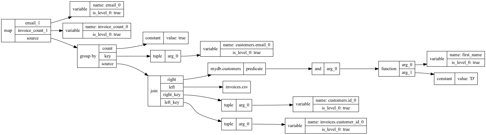
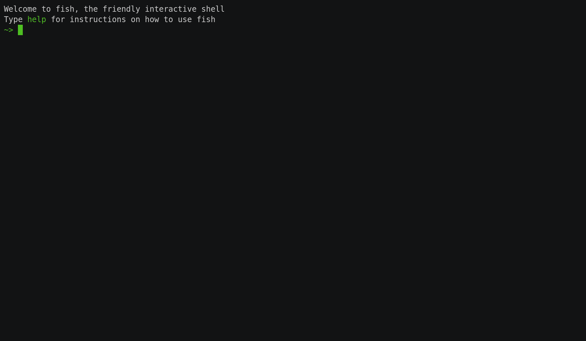

OctoSQL
=======

OctoSQL is predominantly a CLI tool which lets you query a plethora of databases and file formats using SQL through a unified interface, even do JOINs between them. (Ever needed to join a JSON file with a PostgreSQL table? OctoSQL can help you with that.)

At the same time it's an easily extensible full-blown dataflow engine, and you can use it to add a SQL interface to your own applications.

[](https://github.com/cube2222/octosql/actions/workflows/test.yml?query=branch%3Amain)
[](https://goreportcard.com/report/github.com/cube2222/octosql)
[](https://godoc.org/github.com/cube2222/octosql)
[](LICENSE)
[](https://github.com/cube2222/octosql/releases)
[](https://gitter.im/octosql/general?utm_source=badge&utm_medium=badge&utm_campaign=pr-badge)


## Usage

```bash
octosql "SELECT * FROM ./myfile.json"
octosql "SELECT * FROM ./myfile.json" --describe  # Show the schema of the file.
octosql "SELECT invoices.id, address, amount
         FROM invoices.csv JOIN db.customers ON invoices.customer_id = customers.id
         ORDER BY amount DESC"
octosql "SELECT customer_id, SUM(amount)
         FROM invoices.csv
         GROUP BY customer_id"
```

OctoSQL supports JSON and CSV files out of the box, but you can additionally install plugins to add support for other databases.
```bash
octosql "SELECT * FROM plugins.available_plugins"
octosql plugin install postgres
echo "databases:
  - name: mydb
    type: postgres
    config:
      host: localhost
      port: 5443
      database: mydb
      user: postgres
      password: postgres" > octosql.yml
octosql "SELECT * FROM mydb.users" --describe
octosql "SELECT * FROM mydb.users"
```

You can specify the output format using the `--output` flag. Available values for it are `live_table`, `batch_table`, `csv` and `stream_native`.

The documentation about available aggregates and functions is contained within OctoSQL itself. It's in the `aggregates`, `aggregate_signatures`, `functions` and `function_signatures` tables in the `docs` database.
```bash
octosql "SELECT * FROM docs.functions fs"
+------------------+----------------------------------------+
|     fs.name      |             fs.description             |
+------------------+----------------------------------------+
| 'abs'            | 'Returns absolute value                |
|                  | of argument.'                          |
| 'ceil'           | 'Returns ceiling of                    |
|                  | argument.'                             |
| ...              | ...                                    |
+------------------+----------------------------------------+
```

## Installation

You can install OctoSQL using Homebrew on MacOS or Linux:
```bash
brew install cube2222/octosql/octosql
```
After running it for the first time on MacOS you'll have to go into Preferences -> Security and Privacy -> Allow OctoSQL, as with any app that's not notarized.

You can also download the binary for your operating system directly from the [Releases page](https://github.com/cube2222/octosql/releases), or install using the go command line tool:
```bash
go install -u github.com/cube2222/octosql
```

## Plugins

Only support for CSV and JSON files is built-in into OctoSQL. To use other databases - like PostgreSQL or MySQL - you need to install a plugin. Installing plugins is very easy. The following command installs the latest version of the PostgreSQL plugin:
```bash
octosql plugin install postgres
```
Plugins are grouped into repositories, and potentially have many versions available. The above uses the default **core** repository and tries to install the latest version. So if 0.42.0 was the latest version, the above would be equivalent to:
```bash
octosql plugin install core/postgres@0.42.0
```

Browsing available and installed plugins is possible through OctoSQL itself, behind a SQL interface. The available tables are: `plugins.repositories`, `plugins.available_plugins`, `plugins.available_versions`, `plugins.installed_plugins`, `plugins.installed_versions`.

```bash
~> octosql "SELECT name, description FROM plugins.available_plugins LIMIT 2"
+------------------------+-------------------------------+
| available_plugins.name | available_plugins.description |
+------------------------+-------------------------------+
| 'postgres'             | 'Adds support for             |
|                        | querying PostgreSQL           |
|                        | databases.'                   |
| 'random_data'          | 'Generates random data        |
|                        | for testing.'                 |
+------------------------+-------------------------------+
~> octosql "SELECT plugin_name, version FROM plugins.available_versions WHERE plugin_name='random_data'"
+--------------------------------+----------------------------+
| available_versions.plugin_name | available_versions.version |
+--------------------------------+----------------------------+
| 'random_data'                  | '0.1.0'                    |
| 'random_data'                  | '0.1.1'                    |
| 'random_data'                  | '0.2.0'                    |
+--------------------------------+----------------------------+
```

Some plugins, like the `random_data` plugin, can be used without any additional configuration:
```bash
~> octosql plugin install random_data
Downloading core/random_data@0.2.0...
~> octosql "SELECT * FROM random_data.users" --describe
+---------------------------------+--------------------------+------------+
|              name               |           type           | time_field |
+---------------------------------+--------------------------+------------+
| 'users.avatar'                  | 'String'                 | false      |
| 'users.credit_card'             | '{cc_number: String}'    | false      |
| 'users.date_of_birth'           | 'String'                 | false      |
| 'users.email'                   | 'String'                 | false      |
| 'users.first_name'              | 'String'                 | false      |
| 'users.last_name'               | 'String'                 | false      |
| ...                             | ...                      | ...        |
+---------------------------------+--------------------------+------------+
~> octosql "SELECT first_name, last_name, date_of_birth FROM random_data.users LIMIT 3"
+------------------+-----------------+---------------------+
| users.first_name | users.last_name | users.date_of_birth |
+------------------+-----------------+---------------------+
| 'Alethea'        | 'Kuvalis'       | '1997-01-07'        |
| 'Ambrose'        | 'Spencer'       | '1979-04-18'        |
| 'Antione'        | 'Hodkiewicz'    | '1980-03-04'        |
+------------------+-----------------+---------------------+
```

Others, like the `postgres` plugin, require additional configuration. The configuration file is located at `~/.octosql/octosql.yml`. You can find the available configuration settings for a plugin in its own documentation.
```bash
~> octosql plugin install postgres
Downloading core/postgres@0.1.0...
echo "databases:
  - name: mydb
    type: postgres
    config:
      host: localhost
      port: 5432
      database: postgres
      user: postgres
      password: mypassword" > ~/.octosql/octosql.yml
~> octosql "SELECT * FROM mydb.customers" --describe
+--------------------------+-----------------+------------+
|           name           |      type       | time_field |
+--------------------------+-----------------+------------+
| 'customers.email'        | 'String'        | false      |
| 'customers.first_name'   | 'String'        | false      |
| 'customers.id'           | 'Int'           | false      |
| 'customers.last_name'    | 'String'        | false      |
| 'customers.phone_number' | 'String | NULL' | false      |
+--------------------------+-----------------+------------+
~> octosql "SELECT COUNT(*) FROM mydb.customers"
+-------+
| count |
+-------+
|   183 |
+-------+
```

In order to create your own plugins, see examples of existing plugins:
- [MySQL](https://github.com/cube2222/octosql-plugin-mysql)
- [PostgreSQL](https://github.com/cube2222/octosql-plugin-postgres)
- [Random Data](https://github.com/cube2222/octosql-plugin-random_data)

To test plugins while developing locally, put the plugin binary into `~/.octosql/plugins/core/octosql-plugin-<plugin name>/0.1.0/octosql-plugin-<plugin name>`. That's the location where OctoSQL will be looking for it.

## Troubleshooting
OctoSQL writes logs to `~/.octosql/logs.txt`, which is the place to look for any errors or issues during execution. Only logs of the most recent execution are kept.

## Advanced Features

### The Type System

OctoSQL is statically typed. That means that queries are verified, typechecked, and optimized based on the schemas of the tables and types of any values used in the query.

Most of the type system is straight-forward and intuitive, similar to what you'd find in other SQL dialects, even though the types have names which are closer to common programming languages, not SQL databases - in OctoSQL you'll find `String`'s, not `varchar`'s.

However, OctoSQL also supports **union types**, which means that a value might be one of multiple types. For example, you might have a dataset where a column is usually a Float, but occasionally also a String with the Float inside. Thus, the type of the column would be `Float | String`.

Moreover, `NULL` is its own type, which means that a nullable `Int` column would be represented as `Int | NULL` in OctoSQL.

There's a few helper features to handle this union types in OctoSQL.

First, whenever a type, i.e. `String | Int`, is used in a place where a subtype, i.e. `Int`, is expected, OctoSQL will add a dynamic runtime check which will fail execution only if a `String` value actually ever reaches that place.

Second, you can use type assertions to get a value only if it's of a certain type and otherwise evaluate to `NULL`. The syntax for that is `value::type`. So for example we might have a column `age` of type `String | Int` and would like to get its value only if it's an Int. We can write `age::Int` to express that.

Third, there's a bunch of conversion functions which can help you turn types into other types. For example, the `int` function is able to turn values of many types, including strings, to integers. You could use it like this: `int(age_string)`.

Fourth, and final, there's the `COALESCE` operator which accepts an arbitrary number of arguments and returns the first non-null one. It works very well with what's described in the previous two paragraphs. This way, if you have an `age` column of type `String | Int` and would like to clean it up, you can write `COALESCE(age::int, int(age::string), 0)`. This would return the value of `age` as-is if it's an `Int`, try to parse it if it's a `String`, and just evaluate to `0` if that fails.

### Explaining Query Plans

You can use the `--explain` flag to get a visual explanation of the query plan. Setting it to 1 gives you a query plan but without type and schema information, setting it to 2 includes those too. For the visualization to work you need to have the graphviz dot command installed.

For example, running:
```bash
octosql "SELECT email, COUNT(*) as invoice_count
         FROM invoices.csv JOIN mydb.customers ON invoices.customer_id = customers.id
         WHERE first_name <= 'D'
         GROUP BY email
         ORDER BY invoice_count DESC" --explain 1
```
will produce the following output:


Here we can see that the `first_name <= 'D'` predicate has been pushed down to the `mydb.customers` table query.

### Dataflow

OctoSQL is a dataflow engine. In practice that means it can execute a query and then update it based on changes in the inputs. The way this works in practice is by using retractions, each record sent internally has a `retraction` flag dictating whether it's an `undo` or not.

This also means that OctoSQL can work very well with endless streams of data, or display partial results before calculating the full query.

In order to handle that well, OctoSQL contains the concept of record event times and watermarks. Each Record can have an Event Time (the time when it originally happened). Watermarks (special metadata records) are used to signal the timestamp that will be the lower bound for all future records. I.e. if you have a watermark of `2021-12-13T00:11:03Z` then all future records will have an event time that is past that timestamp. This let's us understand which Records cannot be retracted anymore, and is very useful when grouping by time windows.

OctoSQL is also internally consistent as defined by [this article](https://www.scattered-thoughts.net/writing/internal-consistency-in-streaming-systems/). This means that the live output at any given time will be a correct output for a common time-prefix of all the inputs. If you're using the `stream-native` output, this guarantee is satisfied whenever a watermark is emitted. (you can treat watermarks as atomic transactions as far as the output is concerned)

That means, that if you have two input streams, and one input stream is a few minutes behind the other, so for example its watermark value is `2021-12-13T00:11:03Z` and the watermark of the other one is `2021-12-13T00:11:07Z`, then the output of OctoSQL at that time will be a correct output based on all events up to `2021-12-13T00:11:03Z` from both streams. The records in the second stream between `2021-12-13T00:11:03Z` and `2021-12-13T00:11:07Z` will be buffered until the first stream catches up.

For `GROUP BY` queries you can specify when you want to udpate the output using the `TRIGGER` clause: `SELECT ... FROM ... GROUP BY ... TRIGGER COUNTING 300, ON WATERMARK, ON END OF STREAM`. You can use the Counting Trigger and/or the Watermark Trigger and/or the End Of Stream Trigger; it defaults to the End Of Stream trigger.

The Watermark Trigger sends values for keys whenever the Watermark rises above the Event Time of the key. The Counting Trigger sends values every time a given number of records arrive for a key. The End Of Stream Trigger sends values for all keys when the stream is over.

We can take a look at an example query which simulates a stream using a JSON file:
```sql
WITH
  with_watermark AS (SELECT *
                     FROM max_diff_watermark(source=>TABLE(clicks.json),
                                              max_diff=>INTERVAL 5 SECONDS,
                                              time_field=>DESCRIPTOR(time), resolution=>INTERVAL 10 SECONDS) c),
  with_tumble AS (SELECT *
                  FROM tumble(source=>TABLE(with_watermark),
                              window_length=>INTERVAL 1 MINUTE,
                              offset=>INTERVAL 0 SECONDS) c),
  counts_per_user AS (SELECT window_end, user_id, COUNT(*) as clicks
                      FROM with_tumble
                      GROUP BY window_end, user_id, TRIGGER ON WATERMARK, COUNTING 500)
SELECT window_end, user_id, clicks
FROM counts_per_user
```
It uses [Table Valued Functions](#table-valued-functions) extensively.

First we create a stream of clicks with Watermarks that lag the latest Event Time seen so far in a Record by 5 seconds. Then organize records into tumbling one-minute windows - each Record gets a new `window_end` field that indicates the end of the window the Record belongs to and becomes its new Event Time. Finally, we group the clicks by user and time window, emitting the count every 500 Records per key, and after we get the Watermark for the window. As you can see on the demo below, for each window we'll get intermediate results and the full result when the Watermark arrives.



### Table Valued Functions

OctoSQL supports Table Valued Functions, which are functions that return a stream of Records as their output.
The following functions are available:
- range: constructs a sequence of integers
  - arguments
    - start: expression - required - inclusive start of range
    - end: expression - required - exclusive end of range
- poll: polls a finite subquery periodically, emitting the current contents of the table
  - arguments
    - source: table - required - finite table to poll
    - poll_interval: expression - optional - interval between polls
- tumble: assigns records to tumbling windows
  - arguments
    - source: table - required - source table
    - window_length: expression - required - length of the window as an interval
    - time_field: descriptor - optional - field to use as the Event Time for the windows
    - offset: expression - optional - offset of the window relative to the beginning of the epoch
- max_diff_watermark: passes the Records forward as-is, while updating their Event Time field to be the field referenced by the `time_field` argument, and sending Watermarks such that the Watermarks are `max_diff` interval before the latest seen Record Event Time
  - arguments
    - source: table - required - source table
    - max_diff: expression - required - difference between the latest Event Time and the Watermark
    - time_field: descriptor - required - field to use as the Event Time
    - resolution: expression - optional - resolution of the Watermarks

Table valued functions must be aliased when used:
```sql
SELECT * FROM range(start=>1, end=>10) r
```

You can specify table arguments using the TABLE(...) operator and field descriptors using the DESCRIPTOR(...) operator. An example query using both of these types of arguments is shown in the [Dataflow section](#dataflow).

The TABLE operator can be used to specify both a simple table name or another table valued function:
```sql
SELECT * FROM poll(source=>TABLE(range(start=>1,end=>10) r)) r
```
or even a whole subquery, but then you have to use another set of parentheses:
```sql
SELECT * FROM poll(source=>TABLE((SELECT * FROM range(start=>1,end=>10) r) r)) r
```

### Join Types

OctoSQL supports two Join strategies: Stream Join and Lookup Join.

One bit of nomenclature before moving forward: watermarked streams are streams that have an Event Time field, emit Watermarks, and are possibly infinite.

#### Stream Join
A Stream Join reads both input streams while storing all Records in memory, matching them by the key, and emitting them as they are processed.

It supports watermarked streams on both sides and the output Watermark will be set to the minimum of both input stream Watermarks in that case. Records newer than the minimum of the input Watermarks will be buffered, not processed, thus guaranteeing [internal consistency](https://www.scattered-thoughts.net/writing/internal-consistency-in-streaming-systems/).

Records with an event time of zero are never buffered.

If you only have one watermarked input stream, then its watermarks will be used, and the other stream will be read fully before emitting any output Records.

If none of the input streams is watermarked, then the Records will be processed without buffering. 

The Stream Join is the default join type, but can also be used by explicitly specifying the `STREAM JOIN` operator.

#### Lookup Join
A Lookup Joins reads Records from the left input (which can be watermarked) and for each Record gets the relevant Records from the right side (which can't be watermarked). Thus, the right side will be evaluated once per left-side Record. 

This also gives OctoSQL more room for optimization, as it can push the Join predicate down to the right-side input, possibly reading only a small subset of the whole right-side input. This is very useful when the left-side input is very small, i.e., a CSV file with a few rows, the right-side input is huge, i.e., a PostgreSQL table with millions of rows, and you expect each left-side Record to be matched with just a few right-side Records. You can make sure this optimization succeeded by using the `--explain` flag and checking whether the predicates are pushed under the right-side input datasource.

The Lookup Join can be used by explicitly specifying the `LOOKUP JOIN` operator.

## Benchmarks

The benchmarks were run on a 2021 MacBook Pro 16 / M1 Max / 32 GB / 1 TB. All binaries are native ARM binaries compiled for Apple Silicon.

The benchmark script can be found [here](benchmarks/benchmarks.sh).

It runs the `SELECT passenger_count, COUNT(*), AVG(total_amount) FROM taxi.csv GROUP BY passenger_count` query against the well-known NYC Yellow Taxi Trip Dataset. Specifically, the CSV file from April 2021 is used. It's a 200MB CSV file with ~2 million rows, 18 columns, and mostly numerical values.

| Command | Mean [s] | Min [s] | Max [s] |    Relative |
|:---|---:|---:|---:|------------:|
| `octosql "SELECT passenger_count, COUNT(*), AVG(total_amount) FROM taxi.csv GROUP BY passenger_count"` | 3.181 ± 0.014 | 3.168 | 3.209 | 1.00 |
| `q -d ',' -H "SELECT passenger_count, COUNT(*), AVG(total_amount) FROM taxi.csv GROUP BY passenger_count"` | 15.891 ± 0.024 | 15.858 | 15.927 | 4.99 |
| `q -d ',' -H -C readwrite "SELECT passenger_count, COUNT(*), AVG(total_amount) FROM taxi.csv GROUP BY passenger_count"` | 1.563 ± 0.002 | 1.559 | 1.566 |        0.49 |
| `textql -header -sql "SELECT passenger_count, COUNT(*), AVG(total_amount) FROM taxi GROUP BY passenger_count" taxi.csv` | 15.254 ± 0.050 | 15.168 | 15.317 | 4.78 |
| `datafusion-cli -f datafusion_commands.txt` | 3.054 ± 0.027 | 3.013 | 3.097 | 0.96 |
| `dsq taxi.csv "SELECT passenger_count, COUNT(*), AVG(total_amount) FROM {} GROUP BY passenger_count"` | 60.681 ± 1.151 | 59.704 | 63.661 | 19.03 |

Here we can see that OctoSQL is fairly good performance wise.

q with caching beats OctoSQL by a factor of 2, but that's because caching means data loading from CSV is omitted, and the optimized SQLite format is used directly.

Non-cached q and textql are considerably slower, most probably because they have to parse the whole CSV file to put it into SQLite and only then query it. OctoSQL runs queries directly on the CSV file, so it's able to use its optimizer to avoid loading columns which aren't used in the query.

DataFusion is around the same performance as OctoSQL for this query. This doesn't reveal though what is apparent when using the datafusion-cli REPL, which is that DataFusion spends 2.7 seconds analyzing and inferring the schema, and then queries only take 0.3 seconds each. Which means that running repeat queries in DataFusion is ridiculously fast in comparison to all other tools.

dsq is slower than the rest, but it's a fairly new project and it's author told me he didn't yet do any performance tuning, so it's bound to get faster soon. Architecturally it's similar to q and textql in that it uses SQLite as the query engine.

## Contributing

OctoSQL doesn't accept external contributions to its source code right now, but you can raise issues or develop external plugins for database types you'd like OctoSQL to support. Create a Pull Request to add a plugin to the core plugins repository (which is contained in the plugin_repository.json file). You can find more details in the [Plugins section](#plugins)
